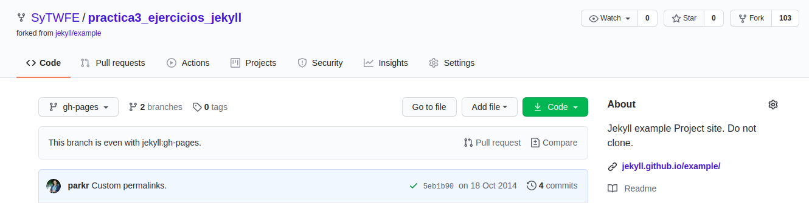
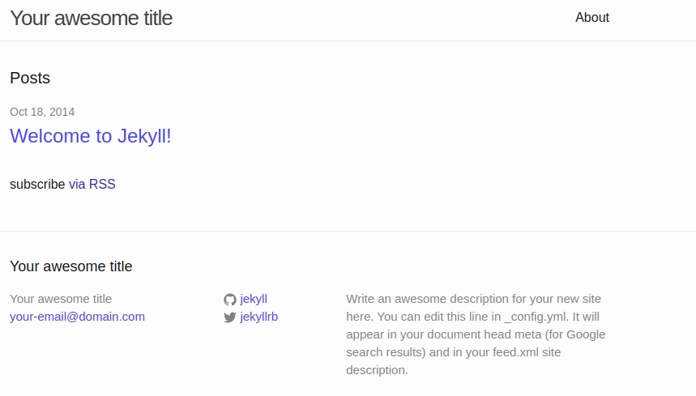
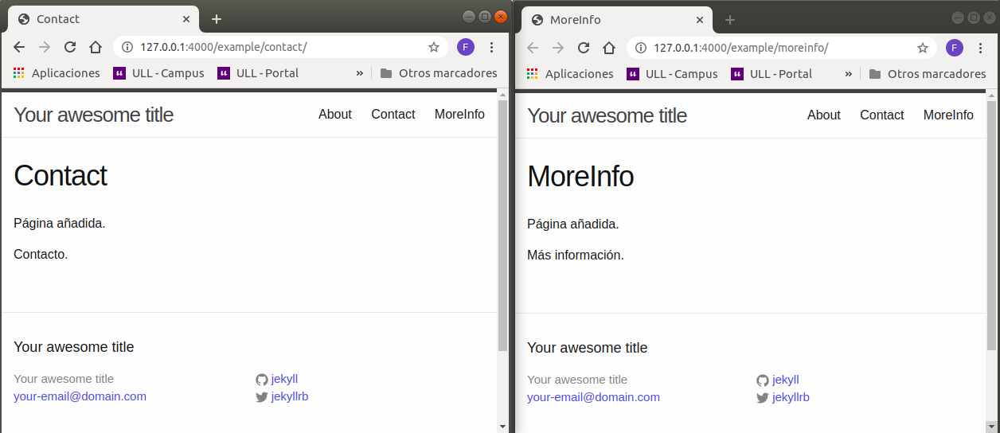
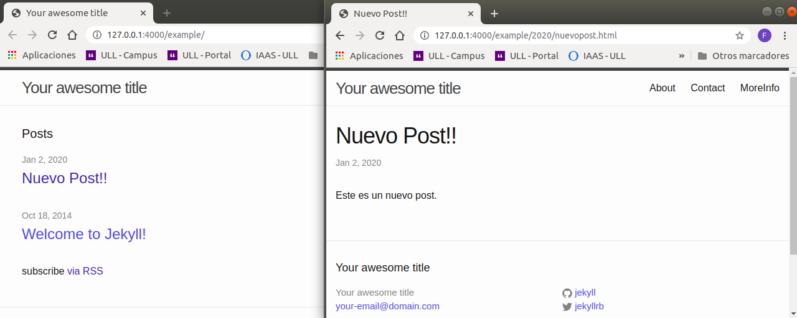
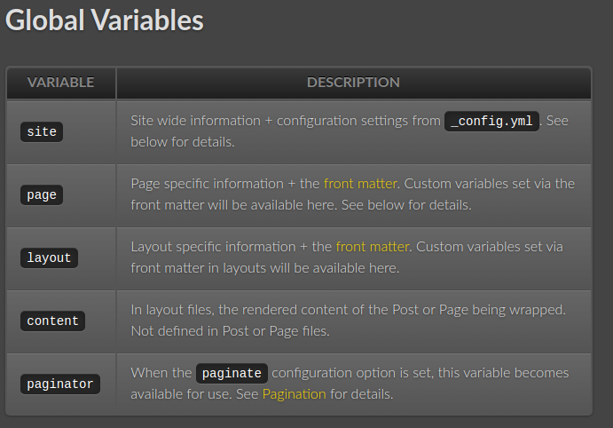
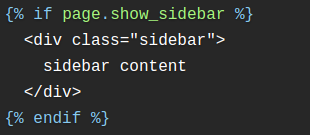

# Práctica3 
## Ejercicios Jekyll

### Pre requisitos

Se realiza un fork del repositorio [Proyecto basico en Jekyll][jekyll]

[jekyll]: https://github.com/jekyll/example



El proyecto se ve inicialmente de la siguiente manera



### Desarrollo de actividades

1. Añade dos página adicionales al proyecto, y haz que se muestren junto con la página About



Añade otro post al proyecto, y haz que se muestre en la página index.html



2. Identifica objetos, filtros y etiquetas en el siguiente fragmento de código e indica cuál es u finalidad.


```
  

    <div class="grid__cell grid__cell--33">
        
    </div>

```

Objeto: *"episodes"*
filtros: *"sort: 'weight' %"*

La finalidad del código es recorrer el obejto episodes, previamente ordenado por su peso, hasta un máximo de 6 (de 1 a 6). A medida de que se vayan recorriendo, se asignara a un <div> un objeto episode de tipo episodes, donde se incluira su respectivo html.

3. Qué código html tendría tendría como salida


```
<html>   
        <head>  
           <title>{{ page.title }} -Ejemplo Jekyll </title>
        </head>
        <body>  
           ` 
           {{ content }}
        </body>  
</html> 
```

En este archivo html en la sección del *"head"* se añaridia como título de la página el título establecido en el archivo de configuración *"_config.yml"* y adicional el texto *"-Ejemplo Jekyll"*. En la sección del *"body"* se incluiria la página *"nav.hmtl*" de la carpeta *"_includes"* y su respectivo contenido

4. Especifica los filtros, variables Jekyll, tags, y qué se consigue con el siguiente código.

```
<footer id="footer">
    <p class="small">© Copyright {{ site.time | date: '%Y' }} {{ site.author }}</p>
</footer>
```

**Filtros:** Cambian la salida de un objeto. Se usan con el simbolo "|". Por ejemplo, para cambiar la salida de un texto en mayuscula:

```
<h1>{{ "HELLO WORLD!" | downcase }}</h1>
```
Se obtendria como resultado el texto en minúscula: 


**Variables:** Permiten establecer configuraciones predeterminadas. Existen variables globales y locales. Las globales, usualmente pueden definirse dentro del archivo *"_config.yml"* y las locales suelen definirse dentro de los archivos en el FrontMater.

Ejemplo de [Variables Globales][var] predeterminadas:

[var]: https://jekyllrb.com/docs/variables/#global-variables



**Tags:**  Permien crear lógica y control dentro de las plantillas. Funcionan bajo los símbolos *""*

Ejemplo de [Tags][tag] predeterminadas:

[tag]: https://jekyllrb.com/docs/step-by-step/02-liquid/#tags



**Resultado del código:**
Dentro del footer, hay una etiqueta de texto que hace llamado a dos variables globales. Una de ellas es la fecha, a la cual se le añade un filtro y únicamente muestra el año. La siguiente variable es el nombre del autor, que lo obtiene del archivo *"_config.yml"* 

5. Indicar qué scripts se están invocando con el siguiente código:

```
<script src="https://ajax.googleapis.com/ajax/libs/jquery/2.1.1/jquery.min.js"></script>
<script src="{{ "/" | relative_url  }}assets/js/main.js"></script>
<script src="{{ "/" | relative_url  }}assets/js/highlight.js"></script>
```

Se incluyen los scripts para el funcionamiento de la página. En el primero, se obtiene direcamente desde la web. Los dos siguientes, se obtienen con una ruta predeterminada. Esta ruta predeterminada *"relative_url*" estaría configurada dentro del archivo *"_config.yml"*.

6. Indica el resultado que se obtiene con el siguiente código, sabiendo que paginas corresponde a la colección de almacenada en _characters

```
<ul class="nav">
    
    
        <li class="nav__item">
            <a href="{{ pagina.url }}">{{ pagina.title }}</a>
        </li>
    
</ul>
```

Primero se asinga a una objeto *"paginas"* todo el contenido de de la colección paginas con un filtro que las ordena por el atributo nombre. Segundo se recorre el objeto paginas y para cada uno de los elementos que lo componen se crea un *"<li>"* con un link de referencia con dos atributos del elemento: la url y el título de la página.

7. Dada una colección de documentos con las siguientes variables en el frontmatter:
```
title: Mi Pagina
thumbnail_url:  https://XXX
image_url: https://
```

Indicar qué objetivo tiene el siguiente include:

```
<a href="{{ character.url }}" class="character-preview">
  
  <div class="character-preview__label">
    {{ character.title }}
  </div>
</a>
```


